# 🚀 NetraDrive API

<div align="center">

<h1>NetraDrive: Your Personal Cloud</br> Powered by Telegram</h1>

<p>
  <b>A powerful, secure, and feature-rich backend for a Google Drive-like service that ingeniously leverages Telegram's unlimited cloud storage.</b>
</p>


</div>

---

## 💡 Core Concept

NetraDrive is built on a simple yet powerful premise: why pay for cloud storage when Telegram offers a robust, fast, and unlimited personal cloud?

This backend API acts as the brain of the operation. It manages users, file and folder metadata, permissions, and the directory structure, while all the actual file data is securely stored in a private Telegram chat. This hybrid approach gives you a rich user experience with virtually limitless storage capacity.

## ✨ Key Features

<ul>
  <li>🗂️ <strong>Full File & Folder Management</strong>: Create, rename, move, and list files and folders with a hierarchical structure.</li>
  <li>📤 <strong>High-Performance Uploads</strong>: Upload files up to 1.5 GB, with SHA256 hashing to prevent content duplication.</li>
  <li>🔗 <strong>Asynchronous URL Uploads</strong>: Initiate downloads from a URL in the background. The API handles the download and upload to Telegram seamlessly.</li>
  <li>📊 <strong>Real-time Task Progress</strong>: Monitor active tasks (like URL uploads) in real-time using WebSockets.</li>
  <li>📥 <strong>Safe & Secure Downloads</strong>: Stream downloads in chunks, ensuring efficient memory usage.</li>
  <li>👁️ <strong>In-Browser File Previews</strong>: Generate previews for common file types that can be viewed directly in the browser.</li>
  <li>🔐 <strong>JWT-Based Authentication</strong>: Secure endpoints with access and refresh tokens for persistent login sessions.</li>
  <li>🗑️ <strong>Soft & Hard deletes</strong>: Move items to a bin (and restore them) or delete them permanently. Folder deletions are fully recursive.</li>
  <li>⭐ <strong>Starred Items</strong>: Mark important files and folders for quick access.</li>
  <li>🔎 <strong>Powerful Search</strong>: Quickly find any file or folder with case-insensitive search.</li>
  <li>🌳 <strong>Folder Tree & Breadcrumbs</strong>: Efficiently fetch the entire directory tree or the path to a specific folder.</li>
  <li>📈 <strong>Storage Usage Calculation</strong>: Instantly calculate the total storage space used by a user.</li>
</ul>

---

## 🛠️ Technology Stack

| Category              | Technology                                                   |
| :-------------------- | :----------------------------------------------------------- |
| **Backend Framework** | FastAPI                                                      |
| **Database**          | MongoDB with Motor (for asynchronous operations)             |
| **File Storage**      | Telegram API (via a service like Pyrogram)                   |
| **Authentication**    | JWT (JSON Web Tokens) with OAuth2PasswordRequestForm         |
| **Data Validation**   | Pydantic V2                                                  |
| **Real-time Comms**   | WebSockets                                                   |
| **Async HTTP Client** | `httpx` (for URL downloads), `aiofiles` (for async file I/O) |

---

## 🏗️ Project Architecture

The API is structured into logical, decoupled modules for maintainability and scalability.

```mermaid
graph TD
    subgraph Client
        A[Web / Mobile App]
    end

    subgraph NetraDrive API FastAPI
        direction LR
        R{Routers}
        S{Services}
        M{Models}
        R --> S
        S --> M
    end

    subgraph Data Layer
        direction TB
        DB[🗄️ MongoDB Metadata]
        TG[📄 Telegram File Storage]
    end

    A -- "REST API / WebSocket" --> R
    S -- "DB Operations" --> DB
    S -- "File I/O" --> TG
```



## ⚙️ Getting Started

Follow these steps to get the NetraDrive API server running on your local machine.

### Prerequisites

- Python 3.10+
- MongoDB Server
- A Telegram Account and Bot Token

### Setup

- Clone the repository:

  ```bash

  git clone https://github.com/snehkr/netradrive-backend.git

  cd netradrive-backend

  ```

- Create a virtual environment and install dependencies:

  ```bash

  python -m venv venv

  source venv/bin/activate # On Windows, use venv\Scripts\activate`

  pip install -r requirements.txt

  ```

- Set up Environment Variables:

  - Create a .env file in the root directory by copying .env.example. Fill in the required values.

  ```toml

  # --- Application Settings ---

  DATABASE_URL="mongodb://localhost:27017"
  DB_NAME="netradrive"

  # --- JWT Authentication ---

  SECRET_KEY="your_super_secret_key_for_jwt"
  REFRESH_SECRET_KEY="your_super_secret_refresh_key_for_jwt"
  ALGORITHM="HS256"
  ACCESS_TOKEN_EXPIRE_MINUTES=30
  REFRESH_TOKEN_EXPIRE_DAYS=7

  # --- Telegram API Credentials (from my.telegram.org) ---

  TELEGRAM_API_ID="your_api_id"
  TELEGRAM_API_HASH="your_api_hash"
  TELEGRAM_BOT_TOKEN="your_bot_token_from_BotFather"

  # The ID of the private Telegram channel/chat where files will be stored

  TELEGRAM_STORAGE_CHAT_ID="-100..."

  ```

- Run the server:

  ```bash
  uvicorn main:app --reload
  ```

- Access the API Docs:

  - Navigate to `http://127.0.0.1:8000/docs` in your browser to see the interactive Swagger UI.

## 📖 API Endpoint Documentation

Here is a summary of the available API endpoints. All endpoints are prefixed with /api/v1.

| Endpoint                                                 | Method   | Description                                                   |
| -------------------------------------------------------- | -------- | ------------------------------------------------------------- |
| **🔐 Authentication (`/api/v1/auth`)**                   |          |                                                               |
|                                                          |          |                                                               |
| `/signup`                                                | `POST`   | Register a new user.                                          |
| `/token`                                                 | `POST`   | Login to get access and refresh tokens.                       |
| `/refresh_token`                                         | `POST`   | Generate a new access token using a refresh token.            |
| `/verify-email `                                         | `GET`    | Verify a user email                                           |
|                                                          |          |                                                               |
| **🗂️ Folders (`/api/v1/folders`)**                       |          |                                                               |
|                                                          |          |                                                               |
| `/`                                                      | `POST`   | Create a new folder.                                          |
| `/`                                                      | `GET`    | List folders in a given parent folder (or root).              |
| `/tree`                                                  | `GET`    | Get the entire nested folder tree structure.                  |
| `/{folder_id}/path`                                      | `GET`    | Get the breadcrumb path for a folder.                         |
| `/{folder_id}/bin`                                       | `PUT`    | Recursively move a folder and its contents to the bin.        |
| `/{folder_id}/restore`                                   | `PUT`    | Recursively restore a folder and its contents from the bin.   |
| `/{folder_id}`                                           | `DELETE` | Permanently and recursively delete a folder and its contents. |
|                                                          |          |                                                               |
| **📄 Files (`/api/v1/files`)**                           |          |                                                               |
|                                                          |          |                                                               |
| `/upload`                                                | `POST`   | Upload a file from your computer.                             |
| `/`                                                      | `GET`    | List files in a given folder (or root).                       |
| `/{file_id}/download`                                    | `GET`    | Download a file.                                              |
| `/{file_id}/bin`                                         | `PUT`    | Move a file to the bin.                                       |
| `/{file_id}/restore`                                     | `PUT`    | Restore a file from the bin.                                  |
| `/{file_id}`                                             | `DELETE` | Permanently delete a file.                                    |
|                                                          |          |                                                               |
| **⚙️ File/Folder Actions (`/api/v1/`)**                  |          |                                                               |
|                                                          |          |                                                               |
| `/files/search/?q={query}`                               | `GET`    | Search for files and folders.                                 |
| `/files/{file_id}/preview`                               | `GET`    | Preview a file in the browser.                                |
| `/{item_type}/{item_id}/rename`                          | `PUT`    | Rename a file or a folder.                                    |
| `/{item_type}/{item_id}/move`                            | `PUT`    | Move a file or a folder to a new parent/root.                 |
| `/{item_type}s/{item_id}/star`                           | `PUT`    | Star a file or folder.                                        |
| `/{item_type}s/{item_id}/unstar`                         | `PUT`    | Unstar a file or folder.                                      |
|                                                          |          |                                                               |
| **📥 URL Downloads (`/api/v1/`)**                        |          |                                                               |
|                                                          |          |                                                               |
| `/upload/from-url`                                       | `POST`   | Submit a URL to be downloaded in the background.              |
| `/upload/status/{job_id}`                                | `GET`    | Get the status and progress of a URL download job.            |
|                                                          |          |                                                               |
| **👤 Users (`/api/v1/ai`)**                              |          |                                                               |
|                                                          |          |                                                               |
| `/me/storage`                                            | `GET`    | Get the current user's total storage usage in bytes.          |
|                                                          |          |                                                               |
| **📢 Tasks & WebSockets (`/api/v1/tasks & /api/v1/ws`)** |          |                                                               |
|                                                          |          |                                                               |
| `/tasks`                                                 | `GET`    | Get all active tasks for a user from memory.                  |
| `/tasks/cancel/{task_id}`                                | `POST`   | Cancel an active transfer task.                               |
| `/tasks/history`                                         | `GET`    | Get finished tasks for a user from the database.              |
| `/ws/tasks/{user_id}`                                    | `WS`     | WebSocket endpoint for real-time task updates.                |

---

## 🤝 Contributing

Contributions are welcome! Please fork the repo and submit a pull request with your changes.

---

## 📜 License

MIT License © 2025 Sneh Kr.
